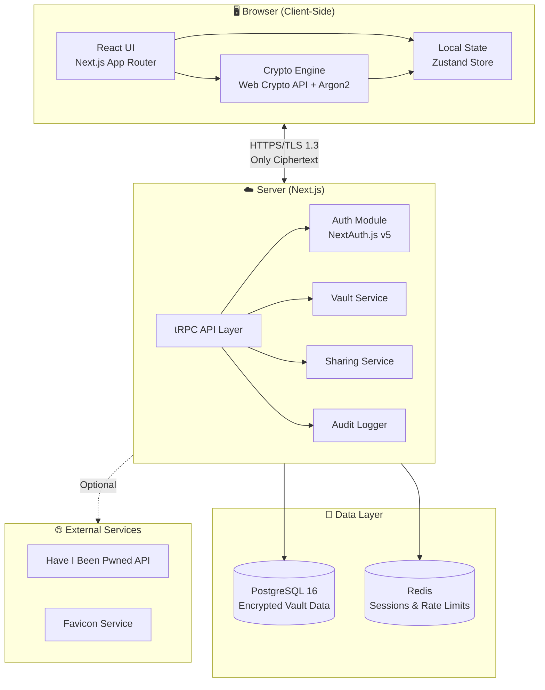
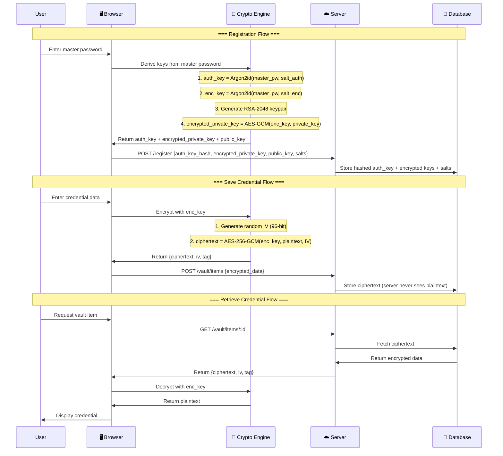
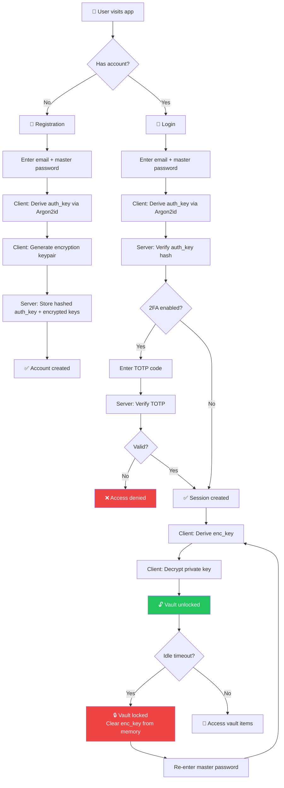
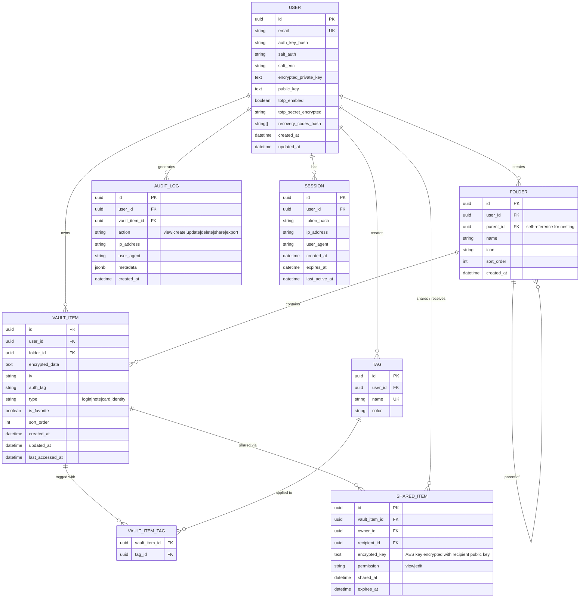
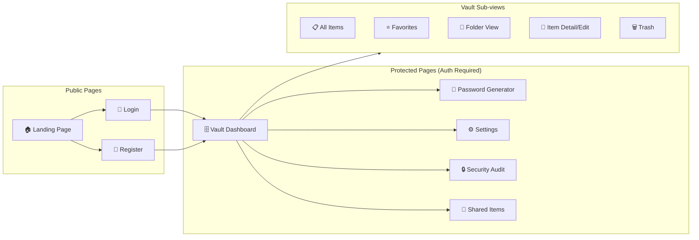
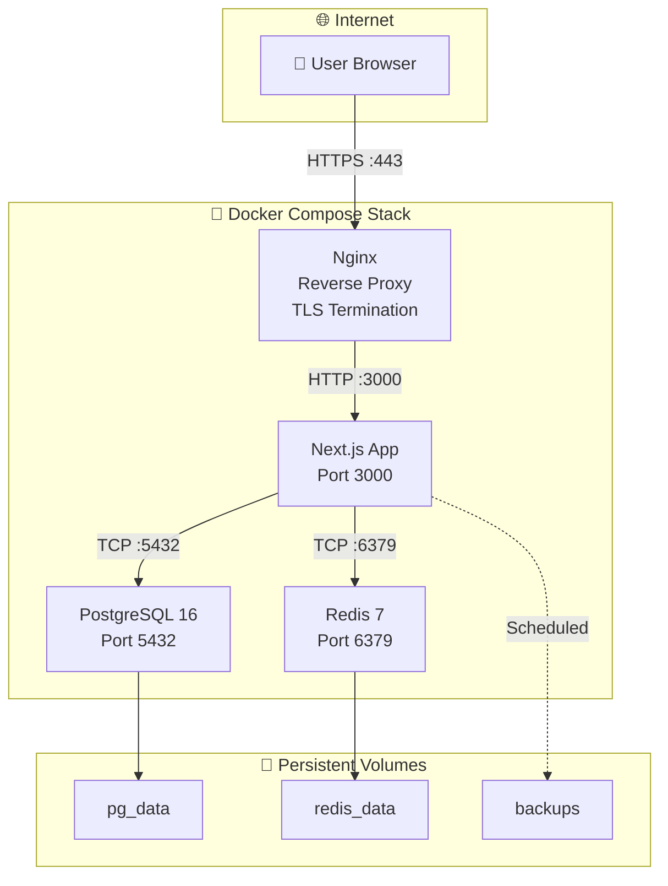

# 🔐 PassMan — Web-Based Password Manager

## PRD (Product Requirements Document)

---

## 1. Latar Belakang & Tujuan

### Problem Statement
Pengelolaan kredensial secara manual (catatan teks, spreadsheet, atau mengingat password) sangat rentan terhadap:
- **Reuse password** di banyak layanan
- **Weak passwords** karena keterbatasan memori manusia
- **Data breach exposure** tanpa mekanisme deteksi
- **Tidak ada audit trail** atas akses kredensial

### Tujuan Produk
Membangun aplikasi **self-hosted password manager** berbasis web (open-source) dengan arsitektur **zero-knowledge encryption**, di mana server tidak pernah mengetahui plaintext kredensial pengguna. Aplikasi ditujukan untuk penggunaan pribadi sekaligus sebagai proyek portofolio GitHub.

### Scope & Batasan
- **Deployment**: Self-hosted, full Dockerized
- **Bahasa UI**: Bahasa Indonesia (default), multi-bahasa (i18n) masuk future plan
- **Platform**: Web-first (Next.js), PWA support untuk akses mobile
- **Browser Extension**: Tidak termasuk dalam scope awal, masuk future plan setelah sistem matang
- **Lisensi**: Open-source (MIT License)

### Success Metrics
| Metric | Target |
|--------|--------|
| Encryption overhead per operation | < 50ms |
| Page load time (First Contentful Paint) | < 1.5s |
| Vault unlock time | < 500ms |
| Zero plaintext credentials stored on server | 100% |

---

## 2. Target Pengguna

| Persona | Deskripsi | Kebutuhan Utama |
|---------|-----------|-----------------|
| **Individual User** | Pengguna pribadi (primary target) yang ingin mengamankan kredensial | Simpan, generate, copy password |
| **Small Team** | Tim kecil (2-10 orang) yang perlu sharing kredensial | Shared vaults, role-based access |
| **Self-Hoster** | Developer/sysadmin yang ingin kontrol penuh | Docker deployment, backup/restore |
| **GitHub Community** | Developer yang ingin fork/contribute | Clean code, documentation, easy setup |

---

## 3. Fitur Produk

### 3.1 Core Features (MVP — Phase 1)

#### 🔑 Master Password & Authentication
- Registrasi dengan master password (tidak disimpan di server)
- Login dengan master password + key derivation di client-side
- Session management dengan JWT + HTTP-only secure cookies
- Auto-lock vault setelah periode inaktivitas (configurable)

#### 🗄️ Vault Management
- **Create/Read/Update/Delete** credential entries
- Setiap entry mendukung field:
  - Nama/Label
  - Username/Email
  - Password (encrypted)
  - URL/Website
  - Notes (encrypted)
  - Tags/Categories
  - Custom fields (encrypted)
  - Favicon auto-fetch
- **Folder/Category** organization
- **Favorites** dan **Recently Used**

#### 🔒 Client-Side Encryption
- Enkripsi/dekripsi dilakukan **sepenuhnya di browser**
- Server hanya menyimpan ciphertext
- AES-256-GCM untuk data encryption
- Argon2id untuk key derivation dari master password

#### 🎲 Password Generator
- Configurable length (8-128 karakter)
- Character sets: uppercase, lowercase, numbers, symbols
- Passphrase generator (diceware-style)
- Password strength indicator (zxcvbn)
- Copy-to-clipboard dengan auto-clear

#### 🔍 Search & Filter
- Full-text search pada nama, username, URL (decrypted client-side)
- Filter by folder, tag, favorites
- Sort by name, date created, date modified

### 3.2 Enhanced Features (Phase 2)

#### 🔄 Two-Factor Authentication (2FA/TOTP)
- TOTP setup dengan QR code
- Backup/recovery codes
- Optional enforcement per user

#### 📋 Credential Sharing
- Share individual entries atau folder dengan user lain
- Permission levels: View-only, Can Edit
- Shared vault dengan enkripsi per-recipient (asymmetric key exchange)

#### 📦 Import/Export
- Import dari: CSV, Bitwarden JSON, LastPass CSV, KeePass XML, 1Password
- Export ke: Encrypted JSON, CSV (with warning)

#### 🔔 Security Alerts
- Breach detection (Have I Been Pwned API integration)
- Weak password detection
- Reused password detection
- Password age monitoring

### 3.3 Advanced Features (Phase 3)

#### 📱 PWA (Progressive Web App)
- Installable di mobile/desktop via browser
- Offline vault access (cached & encrypted)
- Push notifications untuk security alerts

#### 🕐 Audit Log
- Log semua akses vault (view, edit, delete, share)
- IP address dan user-agent tracking
- Retention policy configurable

#### 🗃️ Secure Notes & File Attachments
- Encrypted notes (markdown support)
- Encrypted file attachments (max 10MB per file)

#### 🔄 Emergency Access
- Trusted contact designation
- Time-delayed access grant
- Approval/deny workflow

### 3.4 Future Plan (Backlog)

| Feature | Deskripsi |
|---------|----------|
| 🧩 Browser Extension | Chrome/Firefox extension untuk autofill |
| 🌐 Multi-language (i18n) | Dukungan multi-bahasa (English, dll.) |
| 📱 React Native App | Native mobile app untuk Android/iOS |
| 🔗 WebAuthn/Passkeys | Passwordless authentication |
| 🏢 Organization Support | Multi-tenant untuk tim besar |

---

## 4. Tech Stack

### 4.1 Overview

| Layer | Technology | Justification |
|-------|-----------|---------------|
| **Frontend** | Next.js 15 (App Router) | SSR/SSG, API Routes, React Server Components |
| **UI Library** | React 19 | Component-based architecture |
| **Styling** | Tailwind CSS v4 + shadcn/ui | Rapid UI development, consistent design system |
| **State Management** | Zustand | Lightweight, minimal boilerplate |
| **Backend** | Next.js API Routes + tRPC | Type-safe API, co-located with frontend |
| **Database** | PostgreSQL 16 | ACID compliance, JSONB support, mature ecosystem |
| **ORM** | Prisma | Type-safe queries, migrations, studio |
| **Encryption** | Web Crypto API + `argon2-browser` | Native browser crypto, zero-knowledge |
| **Auth** | NextAuth.js v5 | Session management, JWT |
| **Caching** | Redis | Session store, rate limiting |
| **Containerization** | Docker + Docker Compose | Self-hosted deployment |
| **Testing** | Vitest + Playwright | Unit + E2E testing |

### 4.2 Key Libraries

```
# Frontend
next@15              # React framework
react@19             # UI library
zustand              # State management
@tanstack/react-query # Server state / data fetching
zxcvbn               # Password strength estimation
lucide-react         # Icons
framer-motion        # Animations
sonner               # Toast notifications

# Crypto (Client-side)
argon2-browser       # Argon2id key derivation (WASM)
# Web Crypto API     # AES-256-GCM (native browser)

# Backend
@trpc/server         # Type-safe API
prisma               # Database ORM
ioredis              # Redis client
next-auth@5          # Auth framework
otplib               # TOTP generation/verification
qrcode               # QR code generation

# DevOps
docker               # Containerization
vitest               # Unit testing
playwright           # E2E testing
```

---

## 5. Arsitektur Sistem

### 5.1 High-Level Architecture



### 5.2 Encryption Flow



### 5.3 Authentication Flow



### 5.4 Database ERD



---

## 6. Desain API (tRPC Routers)

### 6.1 Auth Router

| Procedure | Type | Input | Output | Description |
|-----------|------|-------|--------|-------------|
| `auth.register` | Mutation | `{email, authKeyHash, salts, encryptedPrivateKey, publicKey}` | `{userId, session}` | Registrasi user baru |
| `auth.login` | Mutation | `{email, authKey}` | `{session, encryptedPrivateKey, salts}` | Login & dapatkan encrypted keys |
| `auth.verifyTotp` | Mutation | `{code}` | `{verified}` | Verifikasi TOTP code |
| `auth.setupTotp` | Mutation | `{totpSecret}` | `{qrCodeUrl, recoveryCodes}` | Setup 2FA |
| `auth.logout` | Mutation | — | `{success}` | Logout & invalidate session |
| `auth.sessions` | Query | — | `Session[]` | List active sessions |
| `auth.revokeSession` | Mutation | `{sessionId}` | `{success}` | Revoke specific session |

### 6.2 Vault Router

| Procedure | Type | Input | Output | Description |
|-----------|------|-------|--------|-------------|
| `vault.list` | Query | `{folderId?, tagId?, search?, sort?}` | `VaultItem[]` | List vault items (encrypted) |
| `vault.get` | Query | `{id}` | `VaultItem` | Get single item |
| `vault.create` | Mutation | `{encryptedData, iv, authTag, type, folderId?}` | `VaultItem` | Create new item |
| `vault.update` | Mutation | `{id, encryptedData, iv, authTag}` | `VaultItem` | Update item |
| `vault.delete` | Mutation | `{id}` | `{success}` | Soft delete item |
| `vault.toggleFavorite` | Mutation | `{id}` | `{isFavorite}` | Toggle favorite |
| `vault.moveToFolder` | Mutation | `{id, folderId}` | `{success}` | Move to folder |

### 6.3 Folder Router

| Procedure | Type | Input | Output | Description |
|-----------|------|-------|--------|-------------|
| `folder.list` | Query | — | `Folder[]` | List all folders |
| `folder.create` | Mutation | `{name, icon?, parentId?}` | `Folder` | Create folder |
| `folder.update` | Mutation | `{id, name?, icon?}` | `Folder` | Update folder |
| `folder.delete` | Mutation | `{id}` | `{success}` | Delete folder |

### 6.4 Share Router

| Procedure | Type | Input | Output | Description |
|-----------|------|-------|--------|-------------|
| `share.create` | Mutation | `{vaultItemId, recipientEmail, encryptedKey, permission}` | `SharedItem` | Share item |
| `share.revoke` | Mutation | `{shareId}` | `{success}` | Revoke share |
| `share.listSharedWithMe` | Query | — | `SharedItem[]` | Items shared with me |
| `share.listMyShares` | Query | — | `SharedItem[]` | Items I've shared |

---

## 7. Security Model

### 7.1 Zero-Knowledge Architecture

```
┌─────────────────────────────────────────────────────────┐
│                    CLIENT (Browser)                      │
│                                                          │
│  master_password                                         │
│       │                                                  │
│       ├──► Argon2id(pw, salt_auth) ──► auth_key          │
│       │         (for authentication)      │              │
│       │                                   ▼              │
│       │                          SHA-256(auth_key)        │
│       │                              │                   │
│       │                              ▼                   │
│       │                    ┌──── Sent to Server ────┐    │
│       │                    │   auth_key_hash         │    │
│       │                    └────────────────────────┘    │
│       │                                                  │
│       └──► Argon2id(pw, salt_enc) ──► enc_key            │
│                (for encryption)          │               │
│                                          ▼               │
│                              AES-256-GCM encrypt/decrypt │
│                              ┌────────────────────┐      │
│                              │ ✅ Plaintext stays  │      │
│                              │    in browser only  │      │
│                              └────────────────────┘      │
└─────────────────────────────────────────────────────────┘

┌─────────────────────────────────────────────────────────┐
│                    SERVER                                │
│                                                          │
│  ❌ Never receives: master_password, enc_key, plaintext  │
│  ✅ Only stores: auth_key_hash, ciphertext, salts        │
└─────────────────────────────────────────────────────────┘
```

### 7.2 Key Derivation Parameters

| Parameter | Value | Justification |
|-----------|-------|---------------|
| **Algorithm** | Argon2id | Resistant to GPU/ASIC attacks |
| **Memory** | 64 MB | Balance antara security & browser performance |
| **Iterations** | 3 | OWASP recommended minimum |
| **Parallelism** | 4 | Matches average client core count |
| **Salt Length** | 16 bytes | Cryptographically random, unique per user |
| **Output Key Length** | 32 bytes (256-bit) | Matches AES-256 key size |

### 7.3 Threat Model & Mitigations

| Threat | Mitigation |
|--------|------------|
| **Server compromise** | Zero-knowledge: server only has ciphertext |
| **Database leak** | All credentials encrypted with AES-256-GCM |
| **Man-in-the-middle** | TLS 1.3 enforced, HSTS headers |
| **Brute force (master pw)** | Argon2id KDF (computationally expensive), rate limiting |
| **Session hijacking** | HTTP-only, Secure, SameSite cookies |
| **XSS** | CSP headers, sanitized output, React's built-in escaping |
| **CSRF** | SameSite cookies, CSRF tokens |
| **Memory exposure** | Clear sensitive data from memory after use |
| **Clipboard sniffing** | Auto-clear clipboard after 30 seconds |
| **Shoulder surfing** | Password reveal toggle, masked by default |

### 7.4 Security Headers

```
Content-Security-Policy: default-src 'self'; script-src 'self'; style-src 'self' 'unsafe-inline';
Strict-Transport-Security: max-age=31536000; includeSubDomains; preload
X-Content-Type-Options: nosniff
X-Frame-Options: DENY
Referrer-Policy: strict-origin-when-cross-origin
Permissions-Policy: camera=(), microphone=(), geolocation=()
```

---

## 8. UI/UX Design

### 8.1 Page Structure



### 8.2 Design Principles

- **Dark-first design** — dark mode sebagai default, dengan light mode toggle
- **Glassmorphism** — subtle blur effects pada panels
- **Monospace for secrets** — gunakan monospace font untuk password display
- **Color-coded strength** — gradient dari merah (weak) ke hijau (strong)
- **Keyboard-first** — shortcut keys untuk power users (Ctrl+K search, Ctrl+N new item)
- **Motion** — smooth transitions dengan Framer Motion, tidak berlebihan

### 8.3 Responsive Breakpoints

| Breakpoint | Width | Layout |
|------------|-------|--------|
| Mobile | < 640px | Single column, bottom nav |
| Tablet | 640px - 1024px | Sidebar collapsible |
| Desktop | > 1024px | Persistent sidebar + content |

---

## 9. Non-Functional Requirements

### 9.1 Performance

| Metric | Target |
|--------|--------|
| Lighthouse Performance Score | ≥ 90 |
| Time to Interactive | < 2s |
| API Response Time (p95) | < 200ms |
| Encryption/Decryption per item | < 5ms |
| Key Derivation (Argon2id) | < 3s on mobile |
| Max Vault Items | 10,000+ per user |

### 9.2 Scalability

- Stateless API design (horizontal scaling)
- Database connection pooling (PgBouncer)
- Redis untuk session caching
- CDN untuk static assets

### 9.3 Reliability

- Database backup setiap 6 jam
- Auto-recovery mechanism
- Graceful degradation saat Redis down
- Health check endpoints

### 9.4 Compliance

- GDPR-ready (data export, data deletion)
- SOC 2 aligned practices
- Password hashing mengikuti OWASP guidelines

---

## 10. Deployment Architecture



### Docker Compose Overview

```yaml
services:
  app:
    build: .
    ports: ["3000:3000"]
    depends_on: [postgres, redis]
    environment:
      DATABASE_URL: postgresql://...
      REDIS_URL: redis://...
      NEXTAUTH_SECRET: ...

  postgres:
    image: postgres:16-alpine
    volumes: [pg_data:/var/lib/postgresql/data]

  redis:
    image: redis:7-alpine
    volumes: [redis_data:/data]

  nginx:
    image: nginx:alpine
    ports: ["443:443", "80:80"]
    depends_on: [app]
```

---

## 11. Development Roadmap

### Phase 1 — MVP (4-6 minggu)

| Week | Deliverables |
|------|-------------|
| 1 | Project setup, auth system, database schema |
| 2 | Client-side encryption engine, key derivation |
| 3 | Vault CRUD operations, folder management |
| 4 | Password generator, search & filter |
| 5 | UI polish, responsive design, dark/light mode |
| 6 | Docker deployment, testing, security audit |

### Phase 2 — Enhanced (3-4 minggu)

| Week | Deliverables |
|------|-------------|
| 7 | TOTP 2FA setup |
| 8 | Import/Export functionality |
| 9 | Credential sharing (asymmetric encryption) |
| 10 | Security alerts (HIBP, weak/reused passwords) |

### Phase 3 — Advanced (4+ minggu)

| Week | Deliverables |
|------|-------------|
| 11 | Browser extension API |
| 12 | Audit logging system |
| 13 | Secure notes & file attachments |
| 14 | Emergency access, final polish |

---

## 12. Folder Structure

```
passman/
├── prisma/
│   ├── schema.prisma
│   └── migrations/
├── src/
│   ├── app/                          # Next.js App Router
│   │   ├── (auth)/
│   │   │   ├── login/page.tsx
│   │   │   └── register/page.tsx
│   │   ├── (protected)/
│   │   │   ├── vault/page.tsx
│   │   │   ├── generator/page.tsx
│   │   │   ├── settings/page.tsx
│   │   │   ├── security/page.tsx
│   │   │   └── shared/page.tsx
│   │   ├── api/
│   │   │   └── trpc/[trpc]/route.ts
│   │   ├── layout.tsx
│   │   └── page.tsx                  # Landing page
│   ├── components/
│   │   ├── ui/                       # shadcn/ui components
│   │   ├── vault/
│   │   │   ├── VaultList.tsx
│   │   │   ├── VaultItem.tsx
│   │   │   ├── VaultItemForm.tsx
│   │   │   └── VaultSidebar.tsx
│   │   ├── auth/
│   │   │   ├── LoginForm.tsx
│   │   │   └── RegisterForm.tsx
│   │   ├── generator/
│   │   │   └── PasswordGenerator.tsx
│   │   └── layout/
│   │       ├── Header.tsx
│   │       ├── Sidebar.tsx
│   │       └── Footer.tsx
│   ├── lib/
│   │   ├── crypto/
│   │   │   ├── aes.ts               # AES-256-GCM encrypt/decrypt
│   │   │   ├── argon2.ts            # Key derivation
│   │   │   ├── keypair.ts           # RSA keypair management
│   │   │   └── utils.ts             # Random bytes, encoding
│   │   ├── trpc/
│   │   │   ├── client.ts
│   │   │   ├── server.ts
│   │   │   └── routers/
│   │   │       ├── auth.ts
│   │   │       ├── vault.ts
│   │   │       ├── folder.ts
│   │   │       └── share.ts
│   │   ├── db.ts                     # Prisma client
│   │   └── redis.ts                  # Redis client
│   ├── stores/
│   │   ├── vault.store.ts            # Vault state
│   │   ├── auth.store.ts             # Auth state + encryption keys
│   │   └── ui.store.ts               # UI preferences
│   ├── hooks/
│   │   ├── useCrypto.ts
│   │   ├── useVault.ts
│   │   └── useClipboard.ts
│   └── types/
│       ├── vault.ts
│       ├── auth.ts
│       └── crypto.ts
├── docker-compose.yml
├── Dockerfile
├── nginx.conf
├── .env.example
├── package.json
├── tsconfig.json
└── README.md
```

---

## 13. Keputusan yang Telah Diambil

| # | Pertanyaan | Keputusan |
|---|-----------|----------|
| 1 | Nama aplikasi | **PassMan** |
| 2 | Self-hosted vs SaaS | **Self-hosted** (open-source untuk pribadi + GitHub) |
| 3 | Tech stack | **Next.js + PostgreSQL + Prisma + tRPC** ✅ Full Dockerized |
| 4 | Browser extension | **Future plan** — fokus sistem matang dulu |
| 5 | Mobile app | **PWA** untuk multi-platform, web-first priority |
| 6 | Multi-language | **Bahasa Indonesia** dulu, i18n masuk future plan |

---

> [!NOTE]
> Dokumen ini adalah living document yang akan diperbarui seiring perkembangan project. Semua keputusan arsitektur yang diambil akan didokumentasikan di sini sebagai referensi.
